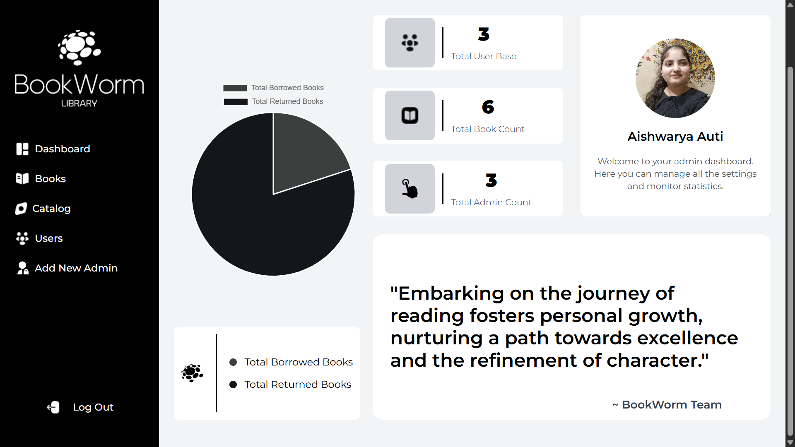
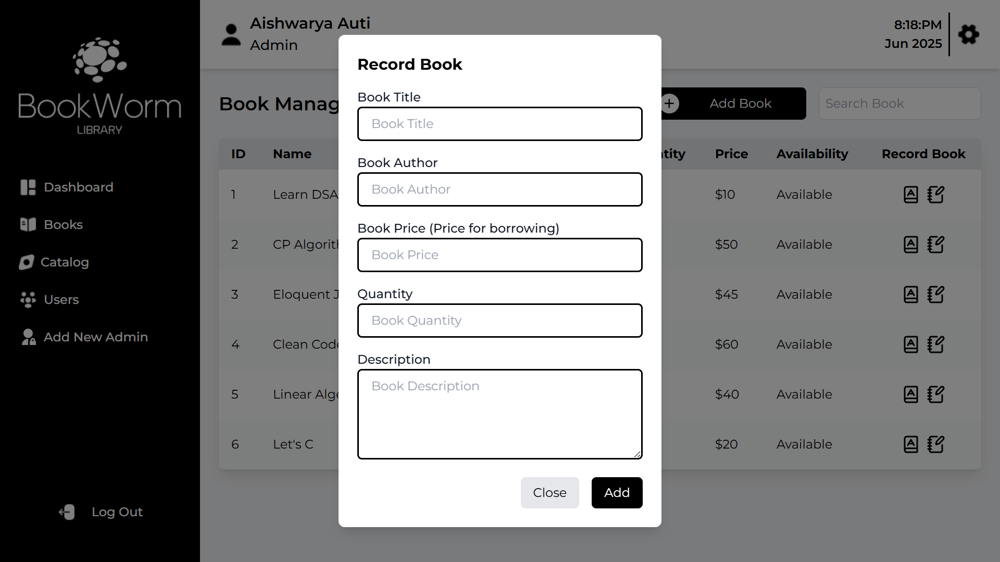
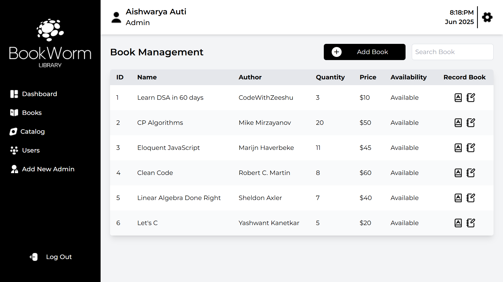
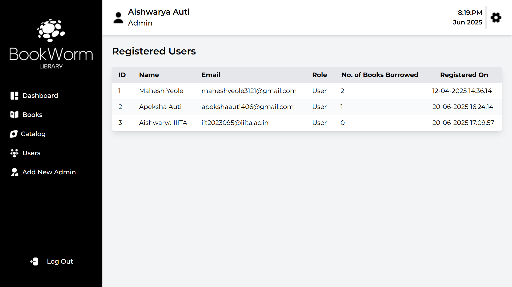
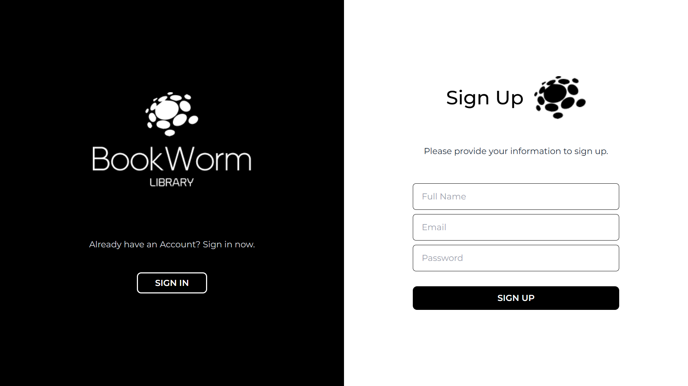

# 📚 Bookworm Library Management System

Welcome to **Bookworm** – a modern, full-stack Library Management System!  
Manage books, users, and borrowing with a beautiful, responsive UI and a powerful backend.

---

## ✨ Features

- 👤 **User & Admin Roles** with OTP email verification
- 📖 **Book Management:** Add, update, delete, and view books
- 🔄 **Borrow & Return** books in real-time
- 📊 **Dashboards** for users and admins
- 💬 **Popups** for book details, adding, and borrowing
- ✅ **Notifications** for errors and successes
- 📱 **Responsive Design** for all devices

---

## 🖼️ Screenshots

### 🏠 Admin Dashboard


### 📚 Book Management



### 👤 User Management



### 🔑 Update Credentials


### 🧑‍💻 User Dashboard


### 📝 Registration Page


---

## 🏗️ Project Structure

```
client/   # React frontend (UI, Redux store, components, pages)
server/   # Node.js backend (MVC: controllers, models, routes, services)
assets/   # Project screenshots and images
```

---

## 🛠️ Tech Stack

- **Frontend:** React, Redux, Tailwind CSS, Vite ⚛️
- **Backend:** Node.js, Express, MongoDB 🌱
- **Other:** Axios, React Toastify, Chart.js

---

## 🚀 Getting Started

### Prerequisites

- Node.js
- npm or yarn
- MongoDB

### Installation

1. **Clone the repository:**
   ```sh
   git clone https://github.com/your-username/your-repo-name.git
   cd your-repo-name
   ```

2. **Install dependencies:**
   - Frontend:
     ```sh
     cd client
     npm install
     ```
   - Backend:
     ```sh
     cd ../server
     npm install
     ```

3. **Configure environment variables:**
   - Edit `server/config/config.env` with your MongoDB URI and secrets.

4. **Run the app:**
   - **Backend:**  
     ```sh
     cd server
     npm run dev
     ```
   - **Frontend (in a new terminal):**  
     ```sh
     cd client
     npm run dev
     ```

5. **Open in browser:**  
   - Frontend: [http://localhost:5173](http://localhost:5173)  
   - Backend API: [http://localhost:4000](http://localhost:4000)

---

## 🌟 Why Bookworm?

Bookworm is designed for simplicity, speed, and a delightful user experience. Whether you’re a librarian, student, or developer, Bookworm makes managing a library fun and efficient.  
**Star this repo** ⭐ if you like it, and feel free to contribute or share your feedback!

---

> 📖 Happy Reading & Coding! Made with ❤️ for book lovers and builders.
